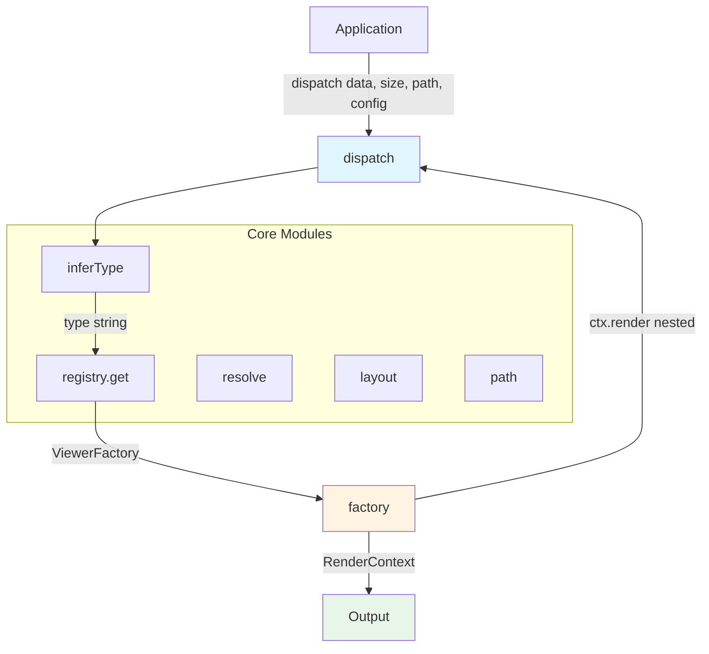
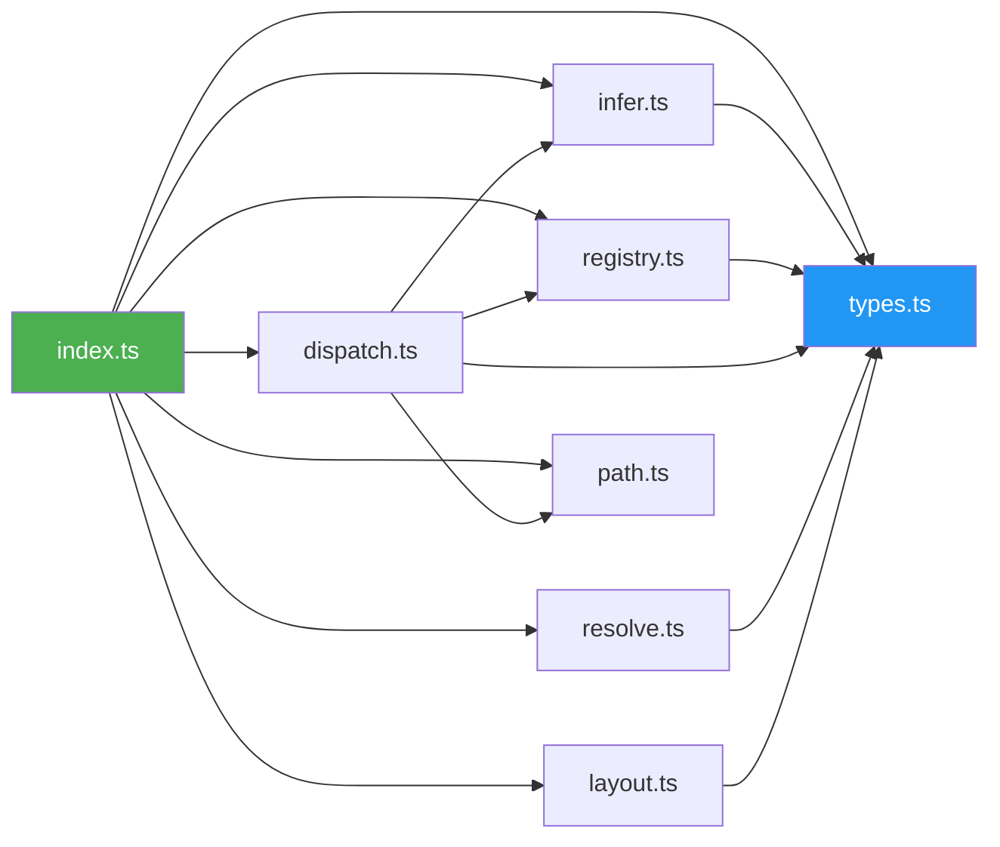
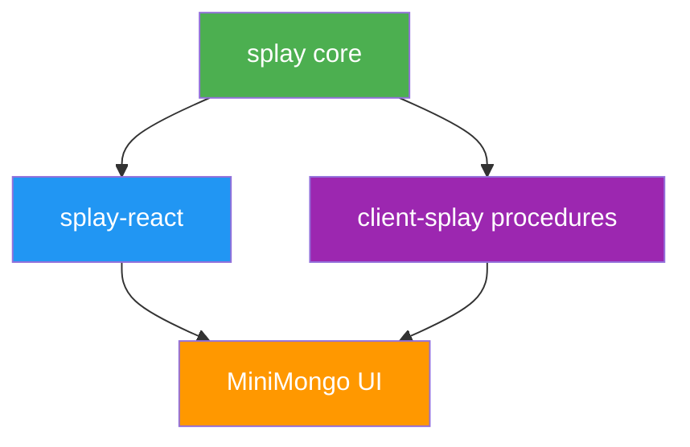

# Splay

[](https://www.typescriptlang.org/)
[](https://opensource.org/licenses/MIT)
[](https://nodejs.org/)

**Minimal recursive data renderer** - A framework-agnostic core for type-driven rendering.

**181 lines** of TypeScript that provide the complete recursive dispatch algorithm for rendering any data structure based on its type.

## Table of Contents

- [Overview](#overview)
- [Architecture](#architecture)
- [Installation](#installation)
- [Core Concepts](#core-concepts)
- [API Reference](#api-reference)
- [Framework Adapters](#framework-adapters)
- [Design Philosophy](#design-philosophy)
- [Dependencies](#dependencies)
- [License](#license)

## Overview

Splay is a framework-agnostic rendering engine that uses **type-driven dispatch** to recursively render any data structure. Instead of hardcoding UI components for specific data shapes, you register viewer factories for types (e.g., "string", "user", "product") and Splay automatically selects and executes the correct viewer based on runtime type inference.

### Key Features

- **Framework Agnostic**: Core has zero framework dependencies - works with React, Vue, Solid, Svelte, or plain strings
- **Type-Driven**: Automatically infers types or use `TYPE_SYMBOL` for custom types
- **Recursive**: Viewers can render nested data via `ctx.render()`
- **Minimal**: Only ~180 lines of TypeScript
- **Layout Utilities**: Built-in grid, list, and split layout calculators
- **Async Resolution**: Handle dynamic/async values with `resolve()`

## Architecture



### Data Flow Diagram

```
┌─────────────────────────────────────────────────────────────────────────────┐
│                              APPLICATION                                     │
│                                                                              │
│   const output = dispatch(data, size, "$", { registry });                   │
│                                                                              │
└───────────────────────────────────────┬─────────────────────────────────────┘
                                        │
                                        ▼
┌─────────────────────────────────────────────────────────────────────────────┐
│                               dispatch()                                     │
│  ┌───────────────────────────────────────────────────────────────────────┐  │
│  │                                                                        │  │
│  │   1. inferType(data)         ───►  "user" | "array" | "string" | ...  │  │
│  │                                            │                           │  │
│  │                                            ▼                           │  │
│  │   2. registry.get(type)      ───►  ViewerFactory | undefined          │  │
│  │                                            │                           │  │
│  │                                            ▼                           │  │
│  │   3. factory(context)        ───►  Output (ReactNode, string, etc)    │  │
│  │         │                                                              │  │
│  │         │ ctx.render(nested, size, path)                              │  │
│  │         └────────────────────────────► dispatch() (recursive)         │  │
│  │                                                                        │  │
│  └───────────────────────────────────────────────────────────────────────┘  │
└─────────────────────────────────────────────────────────────────────────────┘

┌─────────────────────────────────────────────────────────────────────────────┐
│                              CORE MODULES                                    │
│                                                                              │
│  ┌───────────────┐  ┌───────────────┐  ┌───────────────┐  ┌─────────────┐  │
│  │    infer.ts   │  │  registry.ts  │  │  dispatch.ts  │  │  resolve.ts │  │
│  │               │  │               │  │               │  │             │  │
│  │ inferType()   │  │ createRegistry│  │  dispatch()   │  │ resolve()   │  │
│  │ TYPE_SYMBOL   │  │ register()    │  │               │  │ isDynamic() │  │
│  │               │  │ get(), has()  │  │               │  │             │  │
│  └───────────────┘  └───────────────┘  └───────────────┘  └─────────────┘  │
│                                                                              │
│  ┌───────────────┐  ┌───────────────┐                                       │
│  │   layout.ts   │  │    path.ts    │                                       │
│  │               │  │               │                                       │
│  │ gridLayout()  │  │ arrayPath()   │                                       │
│  │ listLayout()  │  │ objectPath()  │                                       │
│  │ splitLayout() │  │ pathDepth()   │                                       │
│  └───────────────┘  └───────────────┘                                       │
│                                                                              │
└─────────────────────────────────────────────────────────────────────────────┘
```

### Module Dependency Graph



## Installation

```bash
npm install github:mark1russell7/splay#main
```

Or with pnpm:

```bash
pnpm add github:mark1russell7/splay#main
```

## Core Concepts

### 1. Type Inference

Every value has a type. Splay infers it automatically or you can tag values with custom types.

```typescript
import { inferType, TYPE_SYMBOL } from "@mark1russell7/splay";

// Built-in types
inferType(null);           // "null"
inferType(undefined);      // "undefined"
inferType("hello");        // "string"
inferType(42);             // "number"
inferType(true);           // "boolean"
inferType([1, 2, 3]);      // "array"
inferType({ a: 1 });       // "object"
inferType(new Date());     // "date"
inferType(() => {});       // "function"

// Custom types via TYPE_SYMBOL
const user = {
  [TYPE_SYMBOL]: "user",
  name: "Alice",
  email: "alice@example.com"
};
inferType(user);           // "user"
```

**Type Inference Rules:**
1. `null` → "null"
2. `undefined` → "undefined"
3. Functions → "function"
4. Primitives → native type ("string", "number", "boolean")
5. Objects with `TYPE_SYMBOL` → custom type string
6. Arrays → "array"
7. Date objects → "date"
8. Plain objects → "object"

### 2. Registry

Register viewer factories for each type. Factories receive a `RenderContext` and return your framework's output type.

```typescript
import { createRegistry, type RenderContext } from "@mark1russell7/splay";

// Create a registry (generic over output type)
const registry = createRegistry<string>();

// Register viewers for primitive types
registry.register("string", (ctx: RenderContext) => `"${ctx.data}"`);
registry.register("number", (ctx: RenderContext) => String(ctx.data));
registry.register("boolean", (ctx: RenderContext) => String(ctx.data));
registry.register("null", (ctx: RenderContext) => "null");

// Register recursive viewer for arrays
registry.register("array", (ctx: RenderContext) => {
  const arr = ctx.data as unknown[];
  const items = arr.map((item, i) =>
    ctx.render(item, ctx.size, `${ctx.path}[${i}]`)
  );
  return `[${items.join(", ")}]`;
});

// Register custom type viewer
registry.register("user", (ctx: RenderContext) => {
  const user = ctx.data as { name: string; email: string };
  return `User(${user.name}, ${user.email})`;
});

// Check if type is registered
if (registry.has("user")) {
  console.log("User viewer registered!");
}

// Get viewer factory
const viewer = registry.get("string");
```

### 3. Dispatch

The recursive dispatch algorithm: infer type → lookup factory → execute → recurse.

```typescript
import { dispatch } from "@mark1russell7/splay";

const myData = {
  name: "Alice",
  age: 30,
  tags: ["developer", "designer"]
};

const result = dispatch(
  myData,                              // data to render
  { width: 400, height: 300 },        // available size
  "$",                                 // path (root)
  {
    registry,                          // type registry
    fallback: (type, data) =>          // fallback for unknown types
      `<unknown type: ${type}>`
  }
);

console.log(result);
// Output depends on registered viewers
```

**Dispatch Algorithm:**
1. Infer the data type using `inferType()`
2. Lookup viewer factory in registry using `registry.get(type)`
3. If not found, call fallback or return undefined
4. Create `RenderContext` with data, size, path, depth, and recursive render function
5. Execute factory with context
6. Factory may call `ctx.render()` to recursively dispatch nested data
7. Return output

### 4. Async Resolution

Handle dynamic/async values with `resolve()`.

```typescript
import { resolve, isDynamic, type DynamicValue, type ResolveContext } from "@mark1russell7/splay";

// Static value
const staticValue: DynamicValue<User> = { name: "Alice", age: 30 };

// Async value (function returning promise)
const asyncValue: DynamicValue<User> = async (ctx: ResolveContext) => {
  const response = await fetch(`/api/users/${ctx.userId}`);
  return response.json();
};

// Dynamic value (function returning static data)
const dynamicValue: DynamicValue<User> = (ctx: ResolveContext) => {
  return ctx.currentUser;
};

// Check if value needs resolution
if (isDynamic(asyncValue)) {
  console.log("Value is dynamic/async");
}

// Resolve value with context
const context: ResolveContext = {
  userId: "123",
  api: myApiClient,
  currentUser: { name: "Bob", age: 25 }
};

const user = await resolve(asyncValue, context);
console.log(user); // { name: "...", age: ... }

// Resolve static value (returns immediately)
const staticUser = await resolve(staticValue);
console.log(staticUser); // { name: "Alice", age: 30 }
```

**Use Cases:**
- Fetch data from APIs based on context
- Lazy-load configuration
- Compute values based on runtime context
- Inject dependencies (theme, locale, permissions)

### 5. Layout Math

Pure functions for computing item positions in containers.

```typescript
import { gridLayout, listLayout, splitLayout, type LayoutItem } from "@mark1russell7/splay";

// Grid Layout: items in columns with fixed row height
const container = { width: 400, height: 300 };
const items = gridLayout(
  container,    // container size
  10,          // item count
  2,           // columns
  40           // row height
);

// Returns array of LayoutItem:
// [
//   { index: 0, pos: { x: 0, y: 0 }, size: { width: 200, height: 40 } },
//   { index: 1, pos: { x: 200, y: 0 }, size: { width: 200, height: 40 } },
//   { index: 2, pos: { x: 0, y: 40 }, size: { width: 200, height: 40 } },
//   ...
// ]

// List Layout: vertical stack with fixed item height
const rows = listLayout(
  { width: 400, height: 300 },
  5,     // item count
  30     // item height
);
// [
//   { index: 0, pos: { x: 0, y: 0 }, size: { width: 400, height: 30 } },
//   { index: 1, pos: { x: 0, y: 30 }, size: { width: 400, height: 30 } },
//   ...
// ]

// Split Layout: horizontal split at ratio
const { left, right } = splitLayout(
  { width: 400, height: 300 },
  0.3  // 30% left, 70% right
);
// left:  { width: 120, height: 300 }
// right: { width: 280, height: 300 }
```

**Layout Utilities:**
- `gridLayout`: Arrange items in a grid with N columns
- `listLayout`: Stack items vertically
- `splitLayout`: Split container into left/right panels

### 6. Path Helpers

Build paths for nested data.

```typescript
import { arrayPath, objectPath, pathDepth } from "@mark1russell7/splay";

// Build array element path
arrayPath("$", 0);              // "$[0]"
arrayPath("$.users", 2);        // "$.users[2]"

// Build object property path
objectPath("$", "name");         // "$.name"
objectPath("$.user", "email");   // "$.user.email"

// Compute path depth
pathDepth("$");                  // 1
pathDepth("$.users");            // 2
pathDepth("$.users[0]");         // 2 (arrays don't increase depth)
pathDepth("$.users[0].name");    // 3
```

**Path Format:**
- Root: `"$"`
- Object properties: `"$.prop.nested"`
- Array elements: `"$[0]"` or `"$.arr[0]"`

## API Reference

### Types

```typescript
// Symbol for marking custom types on objects
export const TYPE_SYMBOL: unique symbol;

// Data types (built-in + custom)
export type DataType =
  | "null"
  | "undefined"
  | "string"
  | "number"
  | "boolean"
  | "date"
  | "array"
  | "object"
  | "function"
  | string; // Custom types

// Dimensions
export interface Size {
  width: number;
  height: number;
}

export interface Position {
  x: number;
  y: number;
}

// Context passed to viewer factories
export interface RenderContext<T = unknown> {
  data: T;                    // The value to render
  size: Size;                 // Available space
  path: string;               // Path like "$.users[0].name"
  depth: number;              // Nesting level
  render: (data: unknown, size: Size, path: string) => unknown; // Recursive render
}

// Viewer factory function
export interface ViewerFactory<Output = unknown> {
  (ctx: RenderContext): Output;
}

// Serializable component output (for SSR/procedures)
export interface ComponentOutput {
  type: string;                          // Component type
  props: Record<string, unknown>;        // Component props
  children?: ComponentOutput[];          // Child components
  key?: string | number;                 // Optional key for lists
}

// Component factory that returns serializable output
export type ComponentFactory<T = unknown> = (ctx: RenderContext<T>) => ComponentOutput;

// Registry interface
export interface Registry<Output> {
  register(type: DataType, factory: ViewerFactory<Output>): void;
  get(type: DataType): ViewerFactory<Output> | undefined;
  has(type: DataType): boolean;
}

// Dispatch configuration
export interface DispatchConfig<Output> {
  registry: Registry<Output>;
  fallback?: (type: DataType, data: unknown) => Output;
}

// Context for async resolution
export interface ResolveContext {
  [key: string]: unknown;  // api, theme, etc.
}

// Static or async value
export type DynamicValue<T = unknown> =
  | T
  | ((ctx: ResolveContext) => T | Promise<T>);

// Layout item with position and size
export interface LayoutItem {
  pos: Position;
  size: Size;
  index: number;
}
```

### Functions

#### Type Inference

**`inferType(value: unknown): DataType`**

Returns the DataType of a value using inference rules.

```typescript
import { inferType } from "@mark1russell7/splay";

inferType("hello");  // "string"
inferType([1, 2]);   // "array"
inferType({ [TYPE_SYMBOL]: "user", name: "Alice" }); // "user"
```

#### Registry

**`createRegistry<Output>(): Registry<Output>`**

Creates a new type registry for viewer factories.

```typescript
import { createRegistry } from "@mark1russell7/splay";

const registry = createRegistry<string>();
registry.register("string", (ctx) => `"${ctx.data}"`);
```

**Registry Methods:**
- `register(type: DataType, factory: ViewerFactory<Output>): void` - Register viewer
- `get(type: DataType): ViewerFactory<Output> | undefined` - Get viewer factory
- `has(type: DataType): boolean` - Check if type is registered

#### Dispatch

**`dispatch<Output>(data: unknown, size: Size, path: string, config: DispatchConfig<Output>): Output | undefined`**

Recursive dispatch algorithm - the core rendering function.

```typescript
import { dispatch } from "@mark1russell7/splay";

const result = dispatch(myData, { width: 400, height: 300 }, "$", {
  registry,
  fallback: (type, data) => `Unknown type: ${type}`
});
```

#### Resolution

**`resolve<T>(value: DynamicValue<T>, context?: ResolveContext): Promise<T>`**

Resolves static or async/dynamic values.

```typescript
import { resolve } from "@mark1russell7/splay";

const user = await resolve(userValue, { api: myApi, userId: "123" });
```

**`isDynamic(value: unknown): value is (ctx: ResolveContext) => unknown`**

Checks if a value is dynamic (function) and needs resolution.

```typescript
import { isDynamic } from "@mark1russell7/splay";

if (isDynamic(value)) {
  const resolved = await resolve(value, context);
}
```

#### Layout

**`gridLayout(container: Size, count: number, cols: number, rowHeight: number): LayoutItem[]`**

Computes grid positions for N items in a container.

```typescript
import { gridLayout } from "@mark1russell7/splay";

const items = gridLayout({ width: 400, height: 300 }, 10, 2, 40);
```

**`listLayout(container: Size, count: number, itemHeight: number): LayoutItem[]`**

Computes vertical list positions.

```typescript
import { listLayout } from "@mark1russell7/splay";

const rows = listLayout({ width: 400, height: 300 }, 5, 30);
```

**`splitLayout(container: Size, ratio?: number): { left: Size; right: Size }`**

Splits container horizontally at ratio (default 0.3).

```typescript
import { splitLayout } from "@mark1russell7/splay";

const { left, right } = splitLayout({ width: 400, height: 300 }, 0.4);
// left: { width: 160, height: 300 }
// right: { width: 240, height: 300 }
```

#### Paths

**`arrayPath(parent: string, index: number): string`**

Builds array element path.

```typescript
import { arrayPath } from "@mark1russell7/splay";

arrayPath("$.users", 0); // "$.users[0]"
```

**`objectPath(parent: string, key: string): string`**

Builds object property path.

```typescript
import { objectPath } from "@mark1russell7/splay";

objectPath("$.user", "name"); // "$.user.name"
```

**`pathDepth(path: string): number`**

Returns nesting depth (number of dots).

```typescript
import { pathDepth } from "@mark1russell7/splay";

pathDepth("$.users[0].name"); // 3
```

## Framework Adapters

Splay core is framework-agnostic. Use adapters for your framework:

### Official Adapters

- **React**: [@mark1russell7/splay-react](https://github.com/mark1russell7/splay-react) - React bindings with `<Viewer>` component

### Building an Adapter

An adapter wraps `dispatch()` in your framework's component system:

```typescript
// Minimal React adapter example
import { memo, type ReactNode } from "react";
import { dispatch, type Size, type Registry } from "@mark1russell7/splay";

export type ReactRegistry = Registry<ReactNode>;

export const Viewer = memo(function Viewer({
  data,
  size,
  path = "$",
  registry,
}: {
  data: unknown;
  size: Size;
  path?: string;
  registry: ReactRegistry;
}): ReactNode {
  return dispatch(data, size, path, {
    registry,
    fallback: (type) => <div style={{ color: "red" }}>Unknown: {type}</div>,
  }) ?? null;
});
```

**Adapter Requirements:**
1. Wrap `dispatch()` in framework component
2. Create registry typed for framework's output (e.g., `ReactNode`, `VNode`)
3. Provide primitive viewers for built-in types
4. Handle recursive rendering via `ctx.render()`

## Design Philosophy

1. **Minimal Core** - Only the essential algorithm (~180 lines)
2. **Framework-Agnostic** - No React/Vue/etc dependencies in core
3. **Type-Driven** - Dispatch based on inferred or tagged types
4. **Recursive** - Viewers call `ctx.render()` for nested data
5. **Composable** - Build complex UIs from simple viewers
6. **Pure Functions** - Layout utilities are pure, no side effects
7. **Zero Magic** - Explicit type registration, clear dispatch flow

## Dependencies

### Production

None - Splay core has **zero runtime dependencies**.

### Development

- `typescript` (^5.9.3) - TypeScript compiler
- `vitest` (^3.0.0) - Testing framework
- `@mark1russell7/cue` - Build configuration tool
- `@mark1russell7/test` - Testing utilities

### Peer Dependencies

None

## Package Structure

```
splay/
├── src/
│   ├── index.ts          # Public API exports
│   ├── types.ts          # Core type definitions
│   ├── infer.ts          # Type inference (inferType)
│   ├── registry.ts       # Type registry (createRegistry)
│   ├── dispatch.ts       # Dispatch algorithm
│   ├── resolve.ts        # Async resolution (resolve, isDynamic)
│   ├── layout.ts         # Layout utilities (grid, list, split)
│   ├── path.ts           # Path utilities (arrayPath, objectPath, pathDepth)
│   └── __tests__/        # Unit tests
├── dist/                 # Compiled output
├── package.json
├── tsconfig.json
└── vitest.config.ts
```

## Integration with Ecosystem

Splay is the foundation for recursive data rendering in the mark1russell7 ecosystem:



- **splay** - Framework-agnostic core (this package)
- **splay-react** - React adapter with `<Viewer>` component
- **client-splay** - Remote procedures for server-side rendering
- **MiniMongo** - Application using splay for recursive data visualization

## Examples

### Example 1: String-Based Renderer

```typescript
import { createRegistry, dispatch, inferType } from "@mark1russell7/splay";

const registry = createRegistry<string>();

registry.register("string", (ctx) => `"${ctx.data}"`);
registry.register("number", (ctx) => String(ctx.data));
registry.register("array", (ctx) => {
  const arr = ctx.data as unknown[];
  const items = arr.map((item, i) =>
    ctx.render(item, ctx.size, `${ctx.path}[${i}]`)
  );
  return `[${items.join(", ")}]`;
});

const data = ["hello", 42, ["nested"]];
const result = dispatch(data, { width: 100, height: 100 }, "$", { registry });
console.log(result); // '["hello", 42, ["nested"]]'
```

### Example 2: Custom Types

```typescript
import { TYPE_SYMBOL, createRegistry, dispatch } from "@mark1russell7/splay";

const registry = createRegistry<string>();

// Register user viewer
registry.register("user", (ctx) => {
  const user = ctx.data as { name: string; role: string };
  return `${user.name} (${user.role})`;
});

// Tag object with custom type
const alice = {
  [TYPE_SYMBOL]: "user",
  name: "Alice",
  role: "Admin"
};

const result = dispatch(alice, { width: 100, height: 100 }, "$", { registry });
console.log(result); // "Alice (Admin)"
```

### Example 3: Async Data

```typescript
import { resolve, isDynamic, type DynamicValue } from "@mark1russell7/splay";

interface User {
  name: string;
  email: string;
}

const fetchUser = async (id: string): Promise<User> => {
  const response = await fetch(`/api/users/${id}`);
  return response.json();
};

const dynamicUser: DynamicValue<User> = async (ctx) => {
  return fetchUser(ctx.userId as string);
};

const user = await resolve(dynamicUser, { userId: "123" });
console.log(user); // { name: "...", email: "..." }
```

## License

MIT © Mark Russell

---

**Repository**: [github.com/mark1russell7/splay](https://github.com/mark1russell7/splay)
**Issues**: [github.com/mark1russell7/splay/issues](https://github.com/mark1russell7/splay/issues)
**Author**: Mark Russell <marktheprogrammer17@gmail.com>
